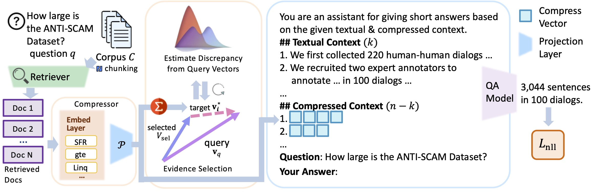

# SARA: Selective and Adaptive Retrieval-augmented Generation with Context Compression

<div align="center">



**A unified RAG framework that balances local precision and global knowledge coverage through hybrid compression**

[](https://arxiv.org/abs/2507.05633)
[](https://github.com/Ahren09/SARA)
[](https://ahren09.github.io/SARA/)
[](LICENSE)

</div>

## 📖 Abstract

Retrieval-augmented Generation (RAG) extends large language models (LLMs) with external knowledge but faces key challenges: restricted *effective* context length and redundancy in retrieved documents. Pure compression-based approaches reduce input size but often discard fine-grained details essential for factual accuracy.

We propose **SARA**, a unified RAG framework that balances *local precision* and *global knowledge coverage* under tight context budgets. SARA combines natural-language text snippets with semantic compression vectors to jointly enhance context efficiency and answer correctness. It represents contexts at two complementary levels:

1. **Fine-grained** natural-language spans that preserve critical entities and numerical values
2. **Compact, interpretable** vectors that summarize high-level semantics

An iterative evidence-selection module employs the compression vectors for dynamic reranking of contexts. Across 9 datasets and 5 open-source LLMs spanning 3 model families (Mistral, Llama, and Gemma), SARA consistently improves answer relevance (+17.71), answer correctness (+13.72), and semantic similarity (+15.53).

## 🚀 Key Features

- **🔀 Hybrid Compression Strategy**: Balances local precision via natural language and global abstraction via compression vectors
- **🔄 Iterative Context Refinement**: Dynamic evidence selection based on embedding-based novelty and conditional self-information (CSI)
- **🧩 Model-Agnostic Design**: Compatible with any retrievers, embedding models, and open-source LLMs
- **📈 Superior Performance**: Consistently outperforms baselines across multiple datasets and models
- **🔍 Interpretable Compression**: Compression vectors can be decoded to reveal underlying semantics
- **⚡ Efficient Training**: Two-stage training procedure with curriculum learning

## 🏗️ Architecture

SARA follows a two-stage training procedure:

### Stage 1: Compression Learning
- **Embedding Alignment**: Lightweight compressor (sentence embedding + MLP) aligns embeddings with LLM token space
- **Context Reconstruction**: Auto-encoder learns to reconstruct original passages from compression vectors  
- **Curriculum Learning**: Progressive training on increasingly complex text chunks for stability

### Stage 2: Instruction-Tuning and Inference
- **Mixed-Format Reasoning**: LLM learns to reason over both natural language and compressed evidence
- **Dynamic Evidence Reranking**: Iterative selection using compression vectors for relevance and diversity
- **Dual Selection Strategies**: 
  - *Embedding-based Novelty*: Minimizes semantic redundancy in selected contexts
  - *Conditional Self-Information*: Quantifies surprisal of new evidence given existing context

## 📦 Installation

### Prerequisites
- Python 3.8+
- CUDA-compatible GPU (16GB+ GPU memory recommended)
- PyTorch 2.0+

### Setup
```bash
# Clone the repository
git clone https://github.com/Ahren09/SARA.git
cd SARA

# Install dependencies
pip install -r requirements.txt

# Install flash-attention for efficient training
pip install flash-attn --no-build-isolation

# Configure accelerate for distributed training
accelerate config
```

### Environment Configuration
```bash
# Set up environment variables
export WANDB_PROJECT="sara-rag"
export HF_HOME="/path/to/huggingface/cache"
export TRANSFORMERS_CACHE="/path/to/transformers/cache"
```

## 📊 Datasets

SARA is evaluated on 9 diverse datasets across different task types:

| Category | Datasets | Description |
|----------|----------|-------------|
| **Short-context QA** | SQuAD-v2.0 | Reading comprehension with unanswerable questions |
| **Long-context QA** | NarrativeQA, QASPER, QuALITY, MultifieldQA-en | Scientific papers, narratives, multi-field documents |
| **Multi-hop Reasoning** | HotpotQA, TriviaQA, 2WikiMultihopQA | Knowledge-intensive and multi-step reasoning |
| **Summarization** | QMSum | Meeting summarization |

### Data Preparation
```bash
# Download and prepare datasets (automated)
python -m src.data.prepare_data

# Construct fine-tuning data with parallel processing
python -m src.data.construct_finetuning_data_mpc \
    --config config/language_modeling/eval.yaml \
    --num_workers 16

# Alternative: Single-threaded processing
python -m src.data.construct_finetuning_data \
    --config config/language_modeling/eval.yaml \
    --output_dir ./outputs
```

## 🎯 Training

### Stage 0: Compression Learning (Pretraining)
Train the compression model on Wikipedia to learn context reconstruction:

```bash
# Single-GPU training
CUDA_VISIBLE_DEVICES=0 python -m src.train.train_generator \
    --config config/language_modeling/Pretrain_Mistral7B.yaml

# Multi-GPU training (recommended)
bash scripts/language_modeling/pretrain_mistral7B_4GPUs.sh
```

### Stage 1: Instruction Tuning
Fine-tune on QA datasets with compression:

```bash
# Mistral-7B instruction tuning
bash scripts/language_modeling/Finetune_Mistral7B.sh

# Llama-3.1-8B instruction tuning  
bash scripts/language_modeling/Finetune_Llama3.1-8B.sh

# MistralNemo instruction tuning
bash scripts/language_modeling/Finetune_MistralNemo.sh
```

### Available Training Scripts
All training scripts are in `scripts/language_modeling/`:

| Model Family | Pretraining | Fine-tuning |
|-------------|-------------|-------------|
| **Mistral** | `pretrain_mistral7B_4GPUs.sh` | `Finetune_Mistral7B.sh` |
| **Llama** | `pretrain_llama.sh` | `Finetune_Llama3.1-8B.sh` |
| **Gemma** | - | Available in config |

## 🔬 Evaluation

### Quick Start Evaluation
```bash
# Evaluate SARA on a single dataset
CUDA_VISIBLE_DEVICES=0 python -m src.eval.run_eval \
    --config config/language_modeling/eval.yaml \
    --model_config config/model/Mistral7B_QA_Compress_Stage1.yaml \
    --dataset_config config/dataset/qasper.yaml \
    --output_dir ./outputs/evaluation

# Calculate performance metrics
python -m src.eval.calculate_qa_performance \
    --prediction_file ./outputs/evaluation/qasper_predictions.jsonl \
    --output_dir ./outputs/metrics
```

### Comprehensive Evaluation
```bash
# Run evaluation across multiple datasets
bash scripts/language_modeling/Eval_Mistral7B_QA_Compress.sh

# Sensitivity analysis (varying k natural language contexts)
bash scripts/language_modeling/Eval_Mistral7B_QA_Compress_Sensitivity.sh

# Evidence selection strategy analysis
bash scripts/language_modeling/Eval_Mistral7B_QA_Compress_Evi-Select.sh
```

### Baseline Comparisons
Evaluate against state-of-the-art baselines:

```bash
# Compression-based baselines
bash scripts/language_modeling/Eval_LLMLingua.sh
bash scripts/language_modeling/Eval_LongLLMLingua.sh
bash scripts/language_modeling/Eval_xRAG.sh

# Summarization-based baselines  
bash scripts/language_modeling/Eval_Raptor.sh
bash scripts/language_modeling/Eval_GraphRAG.sh
```

## 📈 Results

### Main Results (1024 tokens, F1 Score)

| Method | QASPER | NarrativeQA | TriviaQA | QuALITY | HotpotQA | Average |
|--------|--------|-------------|----------|---------|----------|---------|
| Standard RAG | 22.73 | 40.23 | 58.43 | 31.79 | 48.56 | 40.35 |
| Raptor | 31.77 | 56.60 | 70.51 | 34.27 | 68.26 | 52.28 |
| GraphRAG | 37.05 | 64.93 | 77.52 | 37.21 | 73.23 | 57.99 |
| xRAG | 32.36 | 33.43 | 43.36 | 32.65 | 60.19 | 40.40 |
| **SARA (Ours)** | **40.55** | **69.46** | **85.08** | **42.78** | **84.21** | **64.42** |

### Performance Improvements
- **+17.71** Answer Relevance improvement (Mistral-7B)
- **+13.72** Answer Correctness improvement
- **+15.53** Semantic Similarity improvement  
- **+19.4%** F1 improvement under 512 tokens
- **+20.8%** ROUGE-L improvement under 512 tokens

### Generalization Results
SARA demonstrates consistent improvements across model families:

| Model Family | Answer Relevance | Answer Correctness | Semantic Similarity |
|-------------|------------------|--------------------|--------------------|
| **Mistral** | +20.12 | +7.07 | +17.25 |
| **Llama** | +15.84 | +11.42 | +13.91 |
| **Gemma** | +6.83 | +5.82 | +8.76 |

## 🔧 Configuration

### Model Configurations (`config/model/`)
- `Mistral7B_QA_Compress_Stage0.yaml`: Base compression model
- `Mistral7B_QA_Compress_Stage1.yaml`: Instruction-tuned model
- `Llama-3.1-8B-Instruct_QA_Compress_Stage0.yaml`: Llama variant
- `Gemma3-4B.yaml`: Gemma model configuration

### Dataset Configurations (`config/dataset/`)
- `qasper.yaml`: Scientific document QA
- `triviaqa.yaml`: Knowledge-intensive QA  
- `hotpotqa.yaml`: Multi-hop reasoning
- `narrativeqa.yaml`: Reading comprehension
- `quality.yaml`: Multiple-choice reading comprehension

### Key Hyperparameters
```yaml
# Context settings
num_evidence: 10                    # Total retrieved documents
num_natural_language_contexts: 7    # Documents kept as text  
num_additional_evidence: 3          # Documents compressed to vectors
max_context_length: 1024           # Maximum input length

# Training settings
per_device_train_batch_size: 4
gradient_accumulation_steps: 8
learning_rate: 5e-5
warmup_ratio: 0.1
max_train_samples: 30000000

# Evidence selection
evidence_selection: "self-info"     # or "embedding"
repetition_penalty: 1.5
```

## 📝 Analysis and Visualization

### Performance Analysis
```bash
# Analyze compression model predictions
python -m src.analysis.analyze_compress_model_predictions \
    --prediction_file ./outputs/predictions.jsonl

# Word count analysis for compression effectiveness
python -m src.analysis.word_count \
    --input_dir ./outputs/evaluation

# Sensitivity analysis across different k values
python -m src.analysis.analyze_model_answers_sensitivity \
    --results_dir ./outputs/sensitivity
```

### Visualization Scripts (`src/visual/`)
```bash
# Plot generalization across models
python -m src.visual.plot_generalization_base_model_llm_metrics

# Plot sensitivity analysis results  
python -m src.visual.plot_sensitivity_analysis

# Plot compression token effectiveness
python -m src.visual.plot_compress_token

# Plot cross-retriever generalization
python -m src.visual.plot_generalization_retrievers
```

## 🎮 Interactive Demo

### Jupyter Tutorial
Explore SARA's capabilities:
```bash
jupyter notebook introduction.ipynb
```

### Demo Scripts (`src/demo/`)
```bash
# Batch generation demo
python -m src.demo.demo_batch_generation

# Embedding model demonstration
python -m src.demo.demo_embedding_model

# Evidence selection using embeddings
python -m src.demo.demo_evidence_select_using_embedding

# Calculate model confidence metrics
python -m src.demo.demo_confidence_metrics
```

## 🏆 Supported Components

### Language Models
| Family | Models | Status |
|--------|--------|--------|
| **Mistral** | Mistral-7B, MistralNemo-12B, MistralSmall-24B | ✅ Fully Supported |
| **Llama** | Llama-3.1-8B-Instruct | ✅ Fully Supported |
| **Gemma** | Gemma3-4B | ✅ Supported |

### Embedding Models
- **SFR-Embedding-Mistral** (Primary)
- **BGE-M3**
- **GTE-Large**  
- **Stella-en**
- **MPNet**

### Retrievers
- **BM25** (Sparse retrieval)
- **ColBERT-v2** (Dense retrieval)
- **DPR** (Dense Passage Retrieval)
- **BGE-reranker-v2-m3** (Reranking)

## 🛠️ Advanced Usage

### Custom Dataset Integration
1. Create dataset configuration in `config/dataset/your_dataset.yaml`:
```yaml
dataset_name: "your_dataset"
data_path: "/path/to/your/data"
max_length: 1024
prompt_template: "your_template"
```

2. Implement data loading in `src/data/construct_dataset.py`
3. Add evaluation metrics in `src/eval/calculate_qa_performance.py`

### Custom Model Integration
1. Add model configuration in `config/model/your_model.yaml`
2. Implement model class in `src/model/xYourModel/`
3. Update training and evaluation scripts

### Distributed Training
For multi-node training:
```bash
accelerate launch \
    --config_file config/accelerate_config.yaml \
    --num_machines 2 \
    --num_processes 16 \
    --main_process_port 29500 \
    -m src.train.train_generator \
    --config config/language_modeling/your_config.yaml
```

### Memory Optimization
For limited GPU memory:
```bash
# Enable gradient checkpointing and mixed precision
python -m src.train.train_generator \
    --config config/language_modeling/your_config.yaml \
    --gradient_checkpointing \
    --bf16 \
    --per_device_train_batch_size 2 \
    --gradient_accumulation_steps 16
```

## 📊 Monitoring and Logging

### Weights & Biases Integration
```bash
# Initialize wandb project
wandb init --project sara-rag --entity your-entity

# Monitor training progress in real-time
# Logs are automatically synced during training

# Sync offline logs if needed
wandb sync ./wandb/offline-*
```

### Performance Profiling
```bash
# Profile memory usage and training speed
python -m src.language_modeling.profiler \
    --instruction_length 54 \
    --generation_length 30 \
    --dataset triviaqa \
    --use_compression
```

## 🐛 Troubleshooting

### Common Issues and Solutions

**Out of Memory Errors**:
```bash
# Reduce batch size and enable optimizations
--per_device_train_batch_size 1 \
--gradient_accumulation_steps 32 \
--gradient_checkpointing \
--dataloader_pin_memory False
```

**Slow Training**:
```bash
# Ensure flash-attention installation
pip install flash-attn --no-build-isolation

# Use mixed precision training
--mixed_precision bf16

# Increase dataloader workers
--dataloader_num_workers 8
```

**Poor Performance**:
- Verify data preprocessing with `src/demo/demo_sanity_check.py`
- Check model configurations match paper settings
- Ensure sufficient training epochs (typically 3-5 for fine-tuning)

### Debug Mode
```bash
# Enable detailed logging
export TRANSFORMERS_VERBOSITY=debug
export WANDB_MODE=debug

# Test with smaller dataset
python -m src.eval.run_eval \
    --max_eval_samples 100 \
    --config config/language_modeling/eval.yaml
```

## 🚀 Reproducibility

### Exact Paper Results
To reproduce the exact results from the paper:

1. **Environment Setup**:
```bash
pip install -r requirements.txt
# Use the exact package versions specified
```

2. **Model Checkpoints**:
Download pre-trained checkpoints from [HuggingFace Hub](https://huggingface.co/your-username/sara-models)

3. **Evaluation Commands**:
```bash
# Run the exact evaluation used in the paper
bash scripts/language_modeling/Eval_Mistral7B_QA_Compress.sh
bash scripts/language_modeling/Eval_Llama_QA_Compress.sh
```

4. **Random Seeds**:
All experiments use fixed random seeds (42, 123, 456) for reproducibility.

## 📚 Citation

If you find SARA useful in your research, please cite our paper:

```bibtex
@article{jin2025sara,
  title={SARA: Selective and Adaptive Retrieval-augmented Generation with Context Compression},
  author={Jin, Yiqiao and Sharma, Kartik and Rakesh, Vineeth and Dou, Yingtong and Pan, Menghai and Das, Mahashweta and Kumar, Srijan},
  journal={arXiv preprint arXiv:2507.05633},
  year={2025}
}
```

## 🤝 Contributing

We welcome contributions! Please follow these guidelines:

### Development Setup
```bash
# Install development dependencies
pip install -r requirements-dev.txt

# Install pre-commit hooks for code quality
pre-commit install

# Run tests
python -m pytest tests/ -v
```

### Code Style
- Follow PEP 8 guidelines
- Use type hints where applicable  
- Add docstrings for new functions
- Ensure tests pass before submitting PRs

### Areas for Contribution
- Additional embedding models integration
- New baseline implementations
- Optimization improvements
- Documentation enhancements
- Bug fixes and performance improvements

## 📄 License

This project is licensed under the Apache License 2.0 - see the [LICENSE](LICENSE) file for details.

## 🙏 Acknowledgments

- **Datasets**: We thank the creators of SQuAD, QASPER, NarrativeQA, HotpotQA, TriviaQA, and other benchmark datasets
- **Baselines**: We build upon excellent implementations from LLMLingua, xRAG, Raptor, and GraphRAG projects  
- **Infrastructure**: This work was supported by computational resources from Georgia Institute of Technology and Visa Research
- **Community**: Thanks to the open-source community for feedback and contributions

## 📧 Contact

For questions, issues, or collaborations:

- **GitHub Issues**: [Create an issue](https://github.com/Ahren09/SARA/issues)
- **Email**: yjin328@gatech.edu, srijan@gatech.edu
- **Project Website**: [https://ahren09.github.io/SARA/](https://ahren09.github.io/SARA/)

---

<div align="center">

**Made with ❤️ by the SARA Research Team**

[Georgia Institute of Technology](https://www.gatech.edu/) • [Visa Research](https://usa.visa.com/about-visa/visa-research.html)

</div>